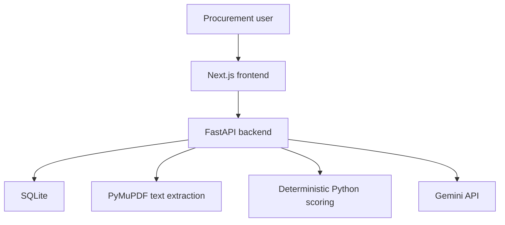

# BidSight

BidSight is an AI-assisted vendor quotation evaluation system that extracts
procurement information from quotation PDFs, validates mandatory requirements,
calculates deterministic vendor scores, and uses Gemini to produce evidence-based
purchasing recommendations.

## What BidSight Does

BidSight provides a reviewable procurement workflow for comparing up to three
vendor quotations. AI structures the document content, a user confirms the
extracted values, and Python applies transparent compliance and scoring rules.

## Core Workflow

```text
Requirements
    -> Quotation PDFs
    -> PyMuPDF text extraction
    -> Gemini structured extraction
    -> Human review and correction
    -> Deterministic Python scoring
    -> Gemini evidence-based recommendation
```

## Key Features

- Procurement evaluation creation and requirements management
- Upload and server-side validation of up to three text-readable quotation PDFs
- Page-by-page PDF text extraction with PyMuPDF
- Typed Gemini extraction into editable procurement fields
- Editable commercial values and technical specifications before scoring
- Mandatory requirement validation with explicit pass, fail, and unknown outcomes
- Deterministic price, technical, delivery, warranty, payment, and support scores
- Vendor comparison that keeps non-compliant quotations visible
- Evidence-based Gemini recommendation restricted to eligible vendors
- Loading, empty, error, retry, and responsive application states

## Tech Stack

### Frontend

- Next.js
- React and TypeScript
- Tailwind CSS
- shadcn/ui-style components built with Radix UI
- Lucide icons

### Backend

- Python and FastAPI
- Pydantic and pydantic-settings
- SQLModel and SQLite
- PyMuPDF
- Google Gen AI SDK for Gemini
- pytest

### Tooling

- `uv` for the Python environment
- `pnpm` for frontend packages

## Architecture



The FastAPI application is a single MVP service. It creates SQLite tables at
startup with `SQLModel.metadata.create_all`, stores uploaded PDFs under
`backend/uploads/`, and exposes REST endpoints under `/api`.

## Gemini's Role

Gemini is used only for:

1. converting extracted quotation text into structured procurement data; and
2. generating a final explanation from verified quotations and Python-generated results.

Gemini does not calculate compliance, price scores, weighted scores, or ranking.
Those calculations remain deterministic Python logic in
`backend/app/services/scoring_service.py`.

## Project Structure

```text
bidsight/
|-- frontend/
|   |-- app/                 # Next.js routes
|   |-- components/          # Reusable UI and workflow components
|   `-- lib/                 # Typed API client, types, and utilities
|-- backend/
|   |-- app/
|   |   |-- routers/         # Evaluation and quotation endpoints
|   |   `-- services/        # PDF, Gemini, and scoring logic
|   |-- tests/
|   `-- uploads/             # Runtime uploads; only .gitkeep is tracked
|-- simple-data/             # Requirements PDF, three quotations, expected results
|-- .env.example
`-- README.md
```

## Prerequisites

- Python 3.11 or newer
- `uv`
- Node.js
- `pnpm`
- A Gemini API key

## Environment Configuration

Create a root `.env` from `.env.example` and keep the real key untracked:

```dotenv
DATABASE_URL=sqlite:///./bidsight.db
GEMINI_API_KEY=
GEMINI_MODEL=gemini-2.5-flash
UPLOAD_DIR=uploads
FRONTEND_URL=http://localhost:3000
MAX_UPLOAD_SIZE_MB=10
```

Create `frontend/.env.local` from `frontend/.env.example`:

```dotenv
NEXT_PUBLIC_API_URL=http://localhost:8000
```

The backend reads the root `.env` or `backend/.env`. Next.js reads
`frontend/.env.local`. Never commit either populated file.

## Backend Setup

From the repository root:

```powershell
cd backend
uv sync --group dev
uv run uvicorn app.main:app --reload
```

The API runs at `http://localhost:8000`. Opening that address returns a small
service status response, while interactive API documentation is available at
`http://localhost:8000/docs`.

## Frontend Setup

In a second terminal:

```powershell
cd frontend
pnpm install
pnpm dev
```

Open `http://localhost:3000`.

## Gemini API Configuration

Create a Gemini API key in Google AI Studio, then assign it to
`GEMINI_API_KEY` in the root `.env`. `GEMINI_MODEL` is optional because the
application has a safe default, but it can be changed without editing source code.

If the key is absent, quotation processing returns the clear error
`Gemini API key is not configured.` The uploaded PDF remains stored so processing
can be retried after configuration is corrected.

## Sample Demo

The repository uses `simple-data/` as its sample folder. It contains:

- `laptop-procurement-requirements.pdf`
- `techcore-solutions-quotation.pdf`
- `digital-systems-quotation.pdf`
- `future-computers-quotation.pdf`
- `expected-results.json`

For the demo, create **Computer Lab Laptop Procurement** with quantity `25`,
budget `PKR 4,000,000`, and required delivery within `14` days. Keep the five
default mandatory requirements, then upload only the three vendor quotation PDFs.

Expected outcome:

- **TechCore Solutions** is compliant and should emerge as the recommendation.
- **Digital Systems** is cheaper but fails the maximum 14-day delivery requirement.
- **Future Computers** is the cheapest but fails the 16 GB RAM and 24-month warranty requirements.

The vendor is not hardcoded. TechCore emerges because it is the highest-ranked
eligible quotation after deterministic compliance and scoring.

## API Documentation

When the backend is running, use `http://localhost:8000/docs` to inspect and try
the REST API. The main endpoints cover evaluations, requirements, quotation upload
and review, scoring, comparison, and recommendation generation.

## Testing and Verification

Backend tests do not require a live Gemini request:

```powershell
cd backend
uv run pytest
```

Frontend checks:

```powershell
cd frontend
pnpm typecheck
pnpm lint
pnpm build
```

The final engineering review verified the production frontend build, TypeScript,
ESLint, FastAPI startup and documentation, PyMuPDF extraction of the sample PDFs,
and 22 backend tests. No live Gemini quota was consumed.

## MVP Scope

BidSight is intentionally a portfolio MVP. It uses local SQLite storage, local PDF
uploads, text-readable PDFs, a single FastAPI service, and a human review gate before
scoring. Authentication, OCR, background jobs, and cloud deployment are not part of
the current implementation.

## Future Improvements

- OCR support for scanned quotations
- Authentication and role-based access
- PostgreSQL and cloud object storage
- Downloadable formal procurement reports

## Disclaimer

BidSight is a procurement decision-support system. AI-generated recommendations are
advisory, and final purchasing decisions remain with authorised users.

## Author

**Badar Butt**

_AI Engineer_
