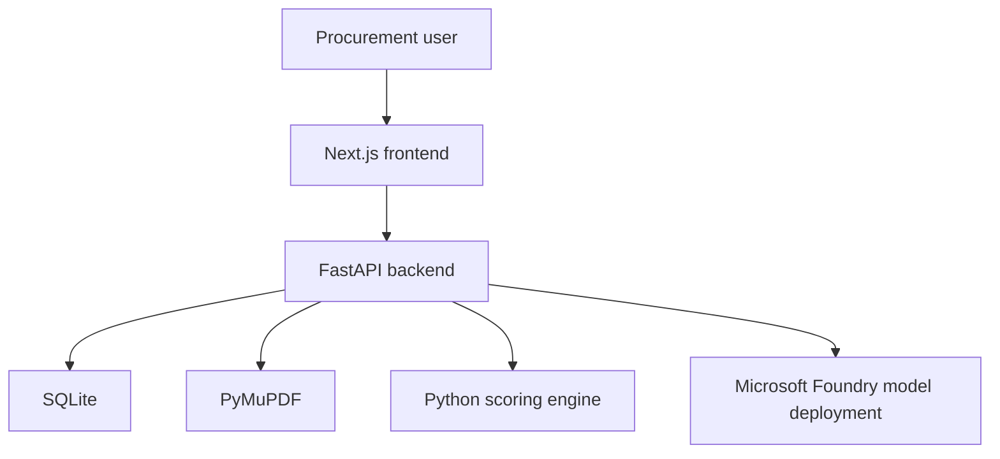

# BidSight

### AI Vendor Quotation Evaluation System

BidSight is a project I built to explore a practical question: how can AI make
procurement work faster without turning an important purchasing decision into a
black box?

The result is a full-stack application that reads vendor quotation PDFs,
structures their commercial and technical information, checks them against
purchasing requirements, calculates transparent vendor scores, and produces an
evidence-based recommendation.

## Why I Built It

Vendor quotations rarely follow one format. Prices, taxes, delivery schedules,
warranties, payment terms, and technical specifications can be scattered across
different pages and tables. When several quotations need to be compared, the
usual process becomes a mixture of manual reading, copy-pasting, and spreadsheet
work.

That creates a few problems I wanted BidSight to address:

- a commercially important detail can be overlooked;
- the lowest price can be confused with the best valid offer;
- mandatory requirements can be applied inconsistently; and
- the final recommendation can be difficult to explain later.

I did not want to solve this by asking an AI model to choose a vendor directly.
That would make the result difficult to reproduce and too dependent on model
judgement. Instead, I designed BidSight so that AI handles language understanding
while normal Python code owns every deterministic procurement calculation.

## My Build Journey

I began with the user experience because I wanted to understand the procurement
journey before committing to backend details. I first shaped the dashboard,
evaluation form, requirement builder, quotation upload, extraction review, and
comparison views as one connected Next.js workflow. Realistic sample states
helped me test the information hierarchy, but the interface was always designed
to be replaced by live API data.

The next step was building the FastAPI backend and a lean SQLite data model. This
is where the most important engineering boundary became clear: document
interpretation could be probabilistic, but procurement rules could not be. I
therefore kept PDF understanding and recommendation language in the AI layer,
while moving compliance, eligibility, price scoring, and weighted scoring into
plain, testable Python.

As the project evolved, I moved the model integration to Microsoft Foundry and a
`gpt-5.6-sol` deployment. I kept that provider-specific code isolated so the rest
of the application still works with typed procurement objects rather than raw
model responses.

The final stage was about making the application feel complete rather than merely
demonstrable. I connected every screen to the backend, added safe quotation and
evaluation deletion, kept dashboard and vendor views consistent after changes,
made exports functional, created a repeatable three-vendor sample scenario, and
added automated tests and handoff documentation.

That journey shaped BidSight into the kind of AI product I wanted to build: one
where automation saves time, but evidence, calculations, and human authority stay
visible.

## The Approach I Took

I separated the system into three clear areas of responsibility.

### AI understands the documents

After PyMuPDF extracts text from a quotation, a Microsoft Foundry model converts
that text into typed procurement fields such as vendor name, product model,
quantity, price, tax, delivery, warranty, payment terms, support, and technical
specifications.

The extraction prompt is intentionally conservative. Missing information stays
missing, unclear terms are identified, and the model is not allowed to estimate
commercial values.

### The user verifies the evidence

AI extraction is useful, but procurement data should not move directly from a
model into a final decision. I added a human review stage where every extracted
field can be inspected and corrected before scoring begins.

### Python makes the calculations

Mandatory compliance, price scores, weighted scores, eligibility, status, and
ranking are calculated by a deterministic Python service. The final Foundry call
receives those verified results and explains them; it cannot change the numbers
or recommend an ineligible vendor.

## How a BidSight Evaluation Flows

```text
Create an evaluation
    → Define purchasing requirements
    → Upload up to three quotation PDFs
    → Extract page text with PyMuPDF
    → Structure the quotation with Microsoft Foundry
    → Review and correct the extracted fields
    → Run deterministic Python compliance and scoring
    → Compare every vendor
    → Generate an evidence-based recommendation
```

The interface presents this as a four-step workspace: Details, Quotations,
Review, and Comparison. It is deliberately designed as a procurement application
rather than a chatbot.

## Decisions That Shaped the Project

- **Human review comes before scoring.** Extracted data never becomes trusted evidence automatically.
- **Scores are reproducible.** The same reviewed inputs always produce the same Python scores.
- **Non-compliant vendors remain visible.** BidSight explains why they failed instead of hiding them.
- **Missing values remain explicit.** The system does not quietly assume compliance.
- **AI recommendations are constrained.** Foundry explains verified results but does not calculate or rewrite them.
- **The architecture stays understandable.** One Next.js frontend, one FastAPI backend, SQLite, and local PDF storage are enough for this product stage.

## A Demo Story Included in the Repository

I created a sample laptop procurement scenario to demonstrate the complete flow.
A school needs 25 laptops within 14 days, with at least 16 GB RAM, 512 GB SSD,
and a 24-month warranty.

The three sample vendors tell a useful procurement story:

- **TechCore Solutions** meets the mandatory requirements and becomes the recommended vendor.
- **Digital Systems** is cheaper, but its 18-day delivery fails the mandatory deadline.
- **Future Computers** is the cheapest, but its RAM and warranty are below the required values.

TechCore is not hardcoded as the winner. It emerges because it is the strongest
eligible quotation after the reviewed data passes through the scoring rules.

The demo files live in `sample-data/`:

- `laptop-procurement-requirements.pdf`
- `techcore-solutions-quotation.pdf`
- `digital-systems-quotation.pdf`
- `future-computers-quotation.pdf`
- `expected-results.json`

## Product Capabilities

- Create and delete procurement evaluations
- Build mandatory and preferred requirements
- Upload and validate one to three PDF quotations
- Extract page-by-page text from digitally generated PDFs
- Convert quotation text into typed fields through Microsoft Foundry
- Review and edit extracted commercial and technical data
- Calculate mandatory compliance and weighted vendor scores
- Compare compliant and non-compliant vendors together
- Generate a recommendation grounded in verified evidence
- Search and manage evaluations and vendors
- Export evaluation, vendor, and comparison data as CSV
- Print or save the comparison as a PDF report
- Remove quotation or evaluation data with linked-file cleanup

## Architecture



| Area                | Technology                                                 |
| ------------------- | ---------------------------------------------------------- |
| Frontend            | Next.js, React, TypeScript, Tailwind CSS, Radix UI, Lucide |
| Backend             | Python, FastAPI, Pydantic, SQLModel                        |
| Database            | SQLite                                                     |
| Document processing | PyMuPDF                                                    |
| AI integration      | Microsoft Foundry through the OpenAI Python SDK            |
| Testing and tooling | pytest, ESLint, TypeScript, `uv`, `pnpm`                   |

## Repository Map

```text
bidsight/
├── frontend/              # Next.js procurement workspace
├── backend/               # FastAPI API, database, PDF, AI, and scoring logic
├── sample-data/           # Complete three-vendor demonstration
├── docs/                  # Product, demo, and Foundry setup guides
├── .env.example
└── README.md
```

I documented each application separately as well:

- [Frontend journey and setup](frontend/README.md)
- [Backend design and setup](backend/README.md)

## Running the Project Locally

The project needs Python 3.11+, `uv`, Node.js, `pnpm`, and a Microsoft Foundry
model deployment.

I keep provider credentials in an untracked root `.env`:

```dotenv
DATABASE_URL=sqlite:///./bidsight.db
FOUNDRY_ENDPOINT=https://YOUR-RESOURCE-NAME.services.ai.azure.com
FOUNDRY_API_KEY=
FOUNDRY_MODEL_DEPLOYMENT=gpt-5.6-sol
FOUNDRY_REQUEST_TIMEOUT_SECONDS=90
UPLOAD_DIR=uploads
FRONTEND_URL=http://localhost:3000
MAX_UPLOAD_SIZE_MB=10
```

The frontend only needs its API URL in `frontend/.env.local`:

```dotenv
NEXT_PUBLIC_API_URL=http://localhost:8000
```

I run the backend from one terminal:

```powershell
cd backend
uv sync --group dev
uv run uvicorn app.main:app --reload
```

Then I run the frontend from a second terminal:

```powershell
cd frontend
pnpm install
pnpm dev
```

The application opens at `http://localhost:3000`, and FastAPI documentation is
available at `http://localhost:8000/docs`.

## Quality Checks

I use the following commands before treating the project as ready:

```powershell
# Backend
cd backend
uv run pytest

# Frontend
cd frontend
pnpm typecheck
pnpm lint
pnpm build
```

The current codebase passes the Next.js production build, TypeScript, ESLint,
and 27 backend tests without requiring a live Foundry call during testing.

## Project Documentation

- [Software Requirements and Implementation Specification](docs/BidSight_MVP_Software_Requirements_and_Implementation_Specification.pdf)
- [Run and Demo Guide](docs/BidSight_Run_and_Demo_Guide.pdf)
- [Microsoft Foundry Configuration Guide](docs/BidSight_Microsoft_Foundry_gpt-sol_Configuration_Guide.pdf)

## Where I Would Take It Next

The current version is intentionally focused. If I continued developing it for
a production environment, the next useful additions would be authentication and
roles, OCR for scanned quotations, PostgreSQL, cloud object storage, audit logs,
and downloadable formal procurement reports.

## Final Note

BidSight is a decision-support product, not an automatic purchasing authority.
The recommendation helps a user understand the evidence and trade-offs, while
the final purchasing decision remains with the authorised procurement team.

## Author

**Badar Rasheed Butt**  
AI Engineer
